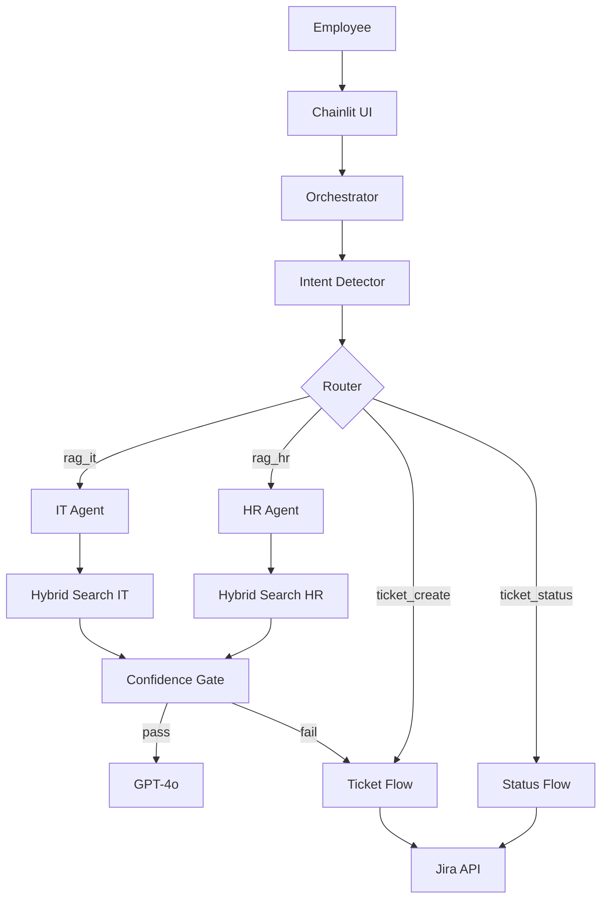

# SmartDesk AI — Implementation Plan

Deadline: Wednesday night
Read CLAUDE.md before writing any code.

---

## Phase 1 — Environment & Scaffolding (2-3 hours)

**Step 1: Repo setup**
- Create GitHub repo: `smartdesk-ai`
- Create `.env.example` with all env var names from CLAUDE.md (no values)
- Create `requirements.txt`:
  ```
  langgraph
  langchain-openai
  openai
  qdrant-client
  sentence-transformers
  rank-bm25
  chainlit
  ragas
  langsmith
  jira
  python-dotenv
  ```
- Create project folder structure from CLAUDE.md

**Step 2: Qdrant setup**
- Run: `docker run -p 6333:6333 qdrant/qdrant`
- Create two collections: `it_kb` and `hr_kb`
- Verify connection with a simple ping

**Step 3: API key verification**
- Test OpenAI API key with a single embedding call
- Test Jira API with a single GET request
- Test LangSmith tracing with a hello-world LangGraph node

---

## Phase 2 — Knowledge Base Construction (3-4 hours)

**Step 4: Gather KB content**
- Download `strova-ai/hr-policies-qa-dataset` from HuggingFace for HR content
- Generate IT content using GPT-4o with prompts from Section 3.2 of capstone brief:
  - VPN setup guide (include Cisco AnyConnect specifically)
  - Password reset process
  - MFA setup
  - Software installation requests
  - Email configuration
  - Guest Wi-Fi access
- Generate 5-10 deliberately unanswerable topics (monitor hardware, parking, etc.)
- Save all content as Markdown files in `kb/it/` and `kb/hr/`

**Step 5: Build indexer (rag/indexer.py)**
- Load each Markdown file
- Split into 500-token chunks with 75-token overlap
- Embed each chunk with `text-embedding-3-small`
- Store in Qdrant with metadata: `{source, category, domain, chunk_id}`
- Verify: run 5 test queries, confirm relevant chunks return

---

## Phase 3 — Retrieval Pipeline (3-4 hours)

**Step 6: Build hybrid retriever (rag/retriever.py)**
- Dense search: query Qdrant with embedded query vector
- BM25 search: index all chunks with `rank-bm25`, search with tokenized query
- RRF merge: implement `score = 1/(rank_dense+60) + 1/(rank_bm25+60)`
- Return top 10 candidates

**Step 7: Add re-ranker**
- Load `cross-encoder/ms-marco-MiniLM-L-6-v2`
- Score each of the top 10 candidates against the query
- Return top 3 re-ranked chunks

**Step 8: Build confidence gate (rag/confidence.py)**
- Implement hybrid gate pseudocode from CLAUDE.md exactly
- Separate thresholds: IT=0.75, HR=0.72 (tune after testing)
- Test with 10 answerable + 10 unanswerable queries, verify correct routing

---

## Phase 4 — Tools (2-3 hours)

**Step 9: search_kb tool**
- Wrap retriever.py in a LangGraph `@tool`
- Returns formatted chunk text for LLM consumption

**Step 10: create_ticket tool**
- Jira REST API: `POST /rest/api/3/issue`
- Fields: summary, description, issue type, priority, labels
- Exponential backoff on 503 (1s, 2s, 4s)
- On success: write to SQLite `{email: ticket_id}`
- Return ticket ID and URL

**Step 11: get_ticket_status tool**
- Read email→ticket_ids from SQLite
- Jira REST API: `GET /rest/api/3/issue/{ticket_id}`
- Return status, assignee, last comment
- Handle: no tickets found, multiple tickets (list them)

---

## Phase 5 — Agent Architecture (4-5 hours)

**Step 12: IT sub-agent (agent/it_agent/graph.py)**
- LangGraph subgraph with nodes: retrieve, generate, escalate
- IT-specific system prompt with grounding instruction
- Uses search_kb_it tool (IT collection only)

**Step 13: HR sub-agent (agent/hr_agent/graph.py)**
- Same structure as IT sub-agent
- HR-specific system prompt
- Uses search_kb_hr tool (HR collection only)

**Step 14: Intent detector (agent/intent_detector.py)**
- GPT-4o call with classification prompt
- Returns: `rag_it`, `rag_hr`, `ticket_create`, `ticket_status`, `ambiguous`
- On ambiguous: return clarifying question

**Step 15: Router (agent/router.py)**
- Conditional edge function
- Maps intent → next node name
- Pure function, no state

**Step 16: Orchestrator (agent/orchestrator.py)**
- Top-level LangGraph graph
- Nodes: intent_detector, router, it_agent, hr_agent, ticket_flow, status_flow
- State: session memory dict
- Handles errors from all sub-agents

---

## Phase 6 — State Machine & HITL (2-3 hours)

**Step 17: Ticket creation flow with state machine**
- States: COLLECTING_EMAIL → COLLECTING_SUMMARY → COLLECTING_DESCRIPTION → CONFIRMING → DONE
- Email validation before storing
- Backward transitions from CONFIRMING
- HITL: present full draft at CONFIRMING, wait for explicit yes
- Post-creation: return ticket ID, transition to DONE

**Step 18: Session memory**
- Session dict initialized on conversation start
- Injected into every LLM API call via system prompt
- Long-term memory read on start, write on end (SQLite)

---

## Phase 7 — Memory & Cache (1-2 hours)

**Step 19: Long-term memory (memory/longterm.py)**
- SQLite table: `employees(email, department, ticket_history, last_interaction)`
- Read on session start → hydrate session dict
- Write on session end → persist email, department, ticket_ids

**Step 20: Semantic cache (cache/semantic_cache.py)**
- In-memory dict: `{embedding_vector: answer}`
- Check before every RAG query
- Threshold: 0.85 cosine similarity for cache hit
- Store answer on cache miss

---

## Phase 8 — UI (1-2 hours)

**Step 21: Chainlit app (app.py)**
- `@cl.on_message` handler wires to orchestrator
- Streaming with `cl.Message`
- Session initialization on `@cl.on_chat_start`
- Error messages surface gracefully in chat

---

## Phase 9 — Evaluation (2-3 hours)

**Step 22: Build test dataset (eval/test_dataset.json)**
- 30 questions with known answers from KB
- 10 questions with no KB answer (should escalate)
- 5 ambiguous questions (should ask for clarification)

**Step 23: Run Ragas evaluation (eval/ragas_eval.py)**
- Metrics: faithfulness, answer_relevance, context_precision
- Run against test dataset
- Target: faithfulness > 0.80
- Save results to `eval/results.json`

---

## Phase 10 — Documentation & Submission (2-3 hours)

**Step 24: README.md**
Must contain:
- Project description (2-3 sentences)
- Prerequisites: Python 3.11+, Docker, API keys
- Setup instructions (5 numbered steps from CLAUDE.md)
- Environment variables list
- How to run the evaluation pipeline
- Architecture diagram (Mermaid)
- Sample conversation screenshots (all 3 flows)
- Evaluation results table

**Step 25: Architecture diagram**


**Step 26: Demo screenshots/video**
Capture all three flows:
1. KB answer (password reset or VPN question)
2. Ticket creation (monitor flickering — unanswerable)
3. Ticket status check

---

## Priority Order (if time runs short)

```
MUST have (core marks):
  Steps 1-11, 14-17, 21, 24

SHOULD have (bonus marks):  
  Steps 12-13 (multi-agent), 22-23 (evaluation), 25-26 (docs)

NICE to have (extra polish):
  Steps 19-20 (long-term memory, semantic cache)
```

---

## Daily Schedule (Mon-Wed)

```
Monday:
  Morning:   Steps 1-5  (environment + KB)
  Afternoon: Steps 6-8  (retrieval pipeline)
  Evening:   Steps 9-11 (tools)

Tuesday:
  Morning:   Steps 12-16 (agent architecture)
  Afternoon: Steps 17-18 (state machine + HITL)
  Evening:   Steps 19-21 (memory + cache + UI)

Wednesday:
  Morning:   Steps 22-23 (evaluation)
  Afternoon: Steps 24-26 (README + diagram + demo)
  Evening:   Final review, push to GitHub, submit
```
