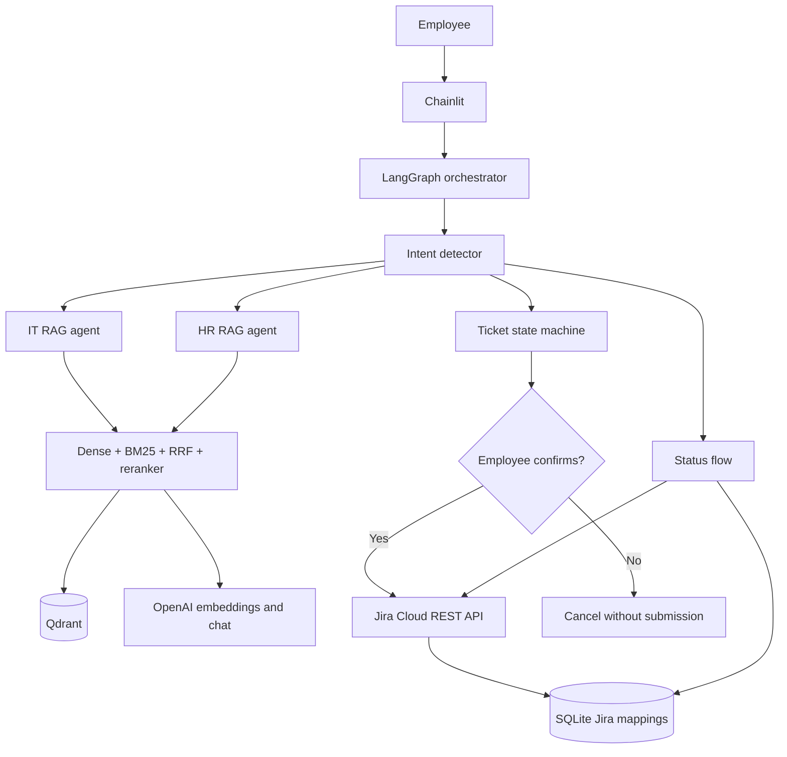
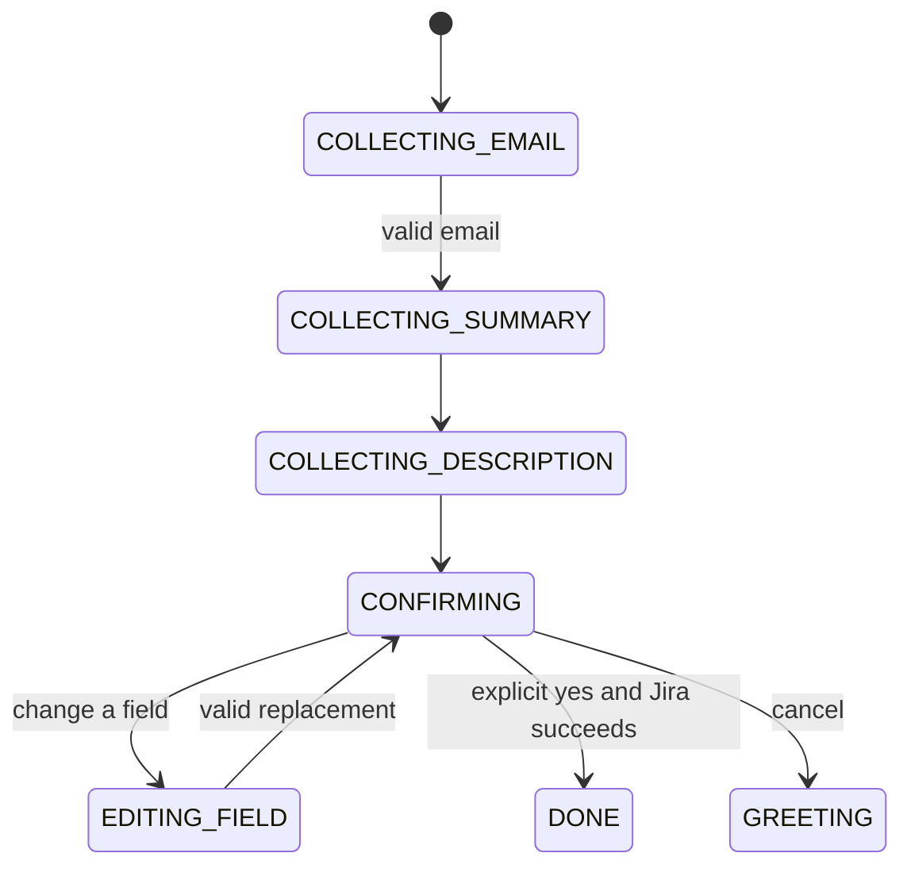

# SmartDesk AI

SmartDesk AI is a Chainlit helpdesk assistant for internal IT and HR support. It answers grounded questions from a Qdrant knowledge base, creates Jira Cloud tickets only after explicit employee confirmation, and retrieves live Jira ticket status.

## What works

- IT and HR intent routing with an LLM and deterministic outage fallback
- Dense + BM25 retrieval with reciprocal-rank fusion and cross-encoder reranking
- Per-domain confidence thresholds and grounded answer generation
- Domain-scoped semantic answer cache
- Human-confirmed Jira ticket creation with editable ticket fields
- Jira retry handling for temporary failures
- Email-to-Jira-key mappings in SQLite
- Live Jira status, assignee, priority, and latest-comment lookup
- Chainlit session state, timeout handling, and SQLite long-term employee memory
- Ragas, escalation, and ambiguous-intent evaluation datasets

## Architecture



## Prerequisites

- Python 3.11 or newer
- Docker with Docker Compose
- An OpenAI API key
- A Jira Cloud site, API token, and project where the configured user can create and view issues

The first RAG request downloads `cross-encoder/ms-marco-MiniLM-L-6-v2`, so the machine needs internet access or a pre-cached model.

## Installation

1. Create and activate a virtual environment:

   ```bash
   python3.11 -m venv .venv
   source .venv/bin/activate
   python -m pip install --upgrade pip
   pip install -r requirements-dev.txt
   ```

2. Create the local environment file:

   ```bash
   cp .env.example .env
   ```

3. Fill in `.env`. Never commit this file.

4. Start Qdrant:

   ```bash
   docker compose up -d
   ```

5. Check configuration and service connectivity:

   ```bash
   python -m scripts.check_setup
   ```

   Use `--offline` to validate configuration names without contacting Jira or Qdrant.

6. Index the knowledge base. This recreates `it_kb` and `hr_kb` so deleted documents cannot remain as stale vectors:

   ```bash
   python -m rag.indexer
   ```

7. Start SmartDesk:

   ```bash
   chainlit run app.py
   ```

### Intel macOS cryptography repair

`cryptography` 49 and newer no longer publish Intel (`x86_64`) macOS wheels. If an
older Intel Mac reports a missing OpenSSL symbol while importing Chainlit, remove
the broken optional package. SmartDesk uses HS256 JWT authentication, which does
not require `cryptography`:

```bash
python -m pip uninstall -y cryptography
```

If another application in the same environment requires `cryptography`, use a
separate environment for it or install the final Intel-compatible wheel with
`python -m pip install --only-binary=:all: "cryptography==48.0.1"`.

## Environment variables

| Variable | Purpose |
|---|---|
| `OPENAI_API_KEY` | Chat and embedding authentication |
| `OPENAI_CHAT_MODEL` | Chat model; defaults to `gpt-4o` |
| `OPENAI_EMBEDDING_MODEL` | Embedding model; defaults to `text-embedding-3-small` |
| `OPENAI_EMBEDDING_DIMENSIONS` | Qdrant vector size; defaults to `1536` |
| `JIRA_BASE_URL` | Jira Cloud base URL, such as `https://company.atlassian.net` |
| `JIRA_EMAIL` | Email belonging to the Jira API token |
| `JIRA_API_TOKEN` | Jira Cloud API token |
| `JIRA_PROJECT_KEY` | Project receiving SmartDesk tickets |
| `JIRA_ISSUE_TYPE` | Available issue type; defaults to `Task` |
| `JIRA_REQUEST_TIMEOUT_SECONDS` | Jira HTTP timeout; defaults to `20` |
| `QDRANT_HOST` / `QDRANT_PORT` | Qdrant connection; defaults to `localhost:6333` |
| `CONFIDENCE_THRESHOLD_IT` | IT reranker confidence threshold; defaults to `0.75` |
| `CONFIDENCE_THRESHOLD_HR` | HR reranker confidence threshold; defaults to `0.72` |
| `SESSION_TIMEOUT_MINUTES` | Conversation timeout; defaults to `30` |
| `LANGCHAIN_API_KEY` | Optional LangSmith tracing key |
| `LANGCHAIN_TRACING_V2` | Enables LangSmith tracing when `true` |

If the Jira project does not expose `Task` or the standard priority names to the configured user, change `JIRA_ISSUE_TYPE` or the priority mapping in `tools/jira_client.py` to match that project.

## Ticket flow



At confirmation, employees can change email, summary, description, category, or priority. A low-confidence RAG answer first enters `ESCALATION_CONFIRMING`; Jira collection begins only after an explicit yes.

## Jira behavior

`tools/jira_client.py` uses Jira Cloud REST API v3 and Atlassian Document Format for descriptions. Temporary HTTP 429, 502, 503, and 504 responses are retried with exponential backoff. Successful Jira keys and employee emails are stored in `tickets.db`; ticket status itself always comes from Jira.

Only tickets created through SmartDesk appear in email-based status lookup. The application does not search all Jira issues by reporter email.

## Testing

Tests mock Jira and do not create real issues:

```bash
pytest
pytest --cov=agent --cov=tools --cov=rag --cov=memory --cov=cache
ruff check .
```

## Evaluation

The RAG evaluation dataset contains 30 answerable and 10 unanswerable questions. A separate dataset contains five ambiguous-intent cases.

Run evaluation only after Qdrant is indexed and OpenAI is configured:

```bash
python -m eval.ragas_eval
```

The command writes `eval/results.json` with:

- faithfulness
- answer relevancy
- context precision
- escalation accuracy
- ambiguous-intent accuracy

### Evaluation results

No scores are included in this copy because live evaluation requires the project owner's OpenAI credentials, indexed Qdrant instance, and downloaded reranker. Run the command above and record the measured results; do not substitute estimated scores.

Targets:

| Metric | Target |
|---|---:|
| Faithfulness | > 0.80 |
| Answer relevancy | > 0.75 |
| Context precision | > 0.75 |
| Escalation accuracy | > 0.90 |
| Ambiguous-intent accuracy | > 0.80 |

## Persistence and production notes

- `tickets.db` stores Jira mappings; `longterm.db` stores limited employee context.
- LangGraph `MemorySaver` and the semantic cache are process-local development components.
- A multi-instance deployment should use Postgres-backed LangGraph checkpoints, Postgres ticket mappings, and Redis caching.
- Email entry alone is not identity verification. Add SSO before using ticket status with real employee data.
- Restrict Jira token permissions to the intended project and rotate exposed tokens immediately.
